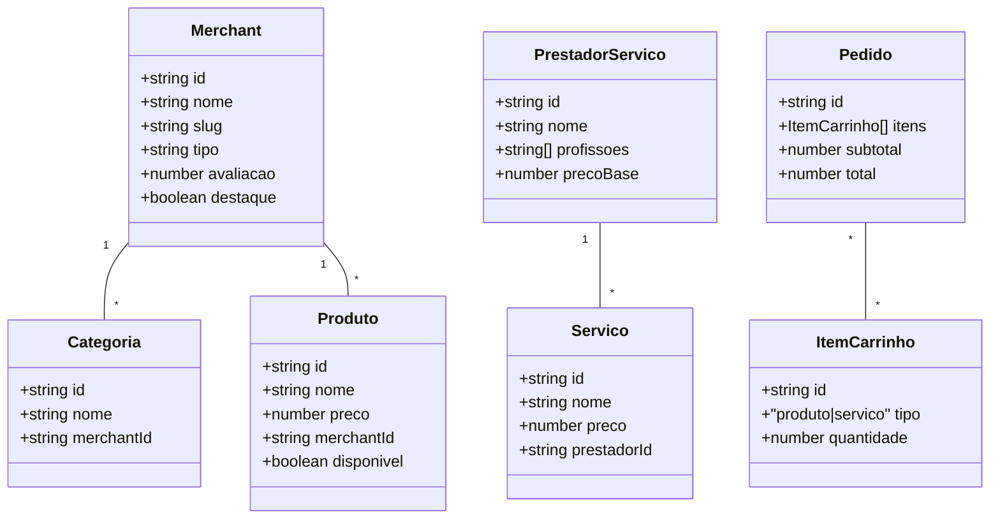
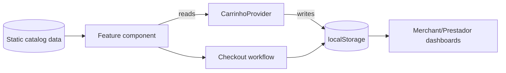
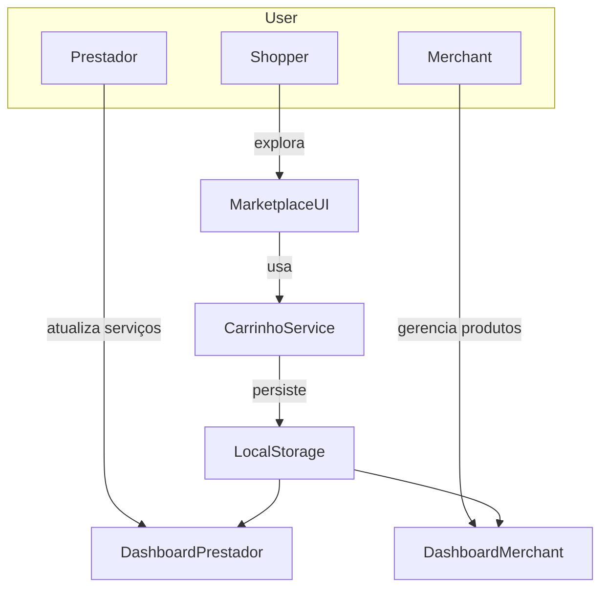
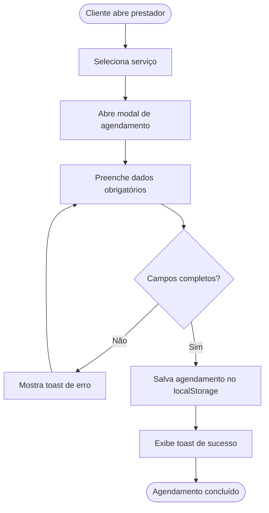
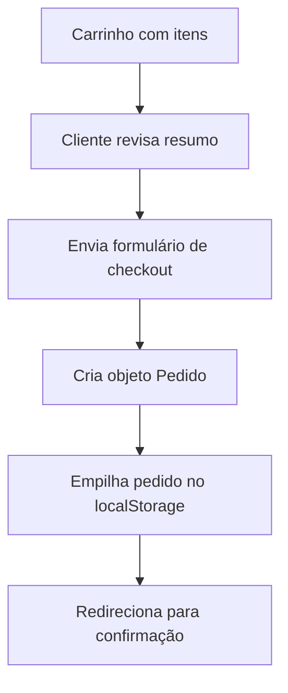

# Multi-Service Marketplace Documentation

## System Overview
The application is a Next.js marketplace that unifies digital storefronts and on-demand service providers under a shared shopping experience. The root layout wires the global providers and UI chrome (header, footer, theming, cart context) so that every route can access shared state and design tokens.【F:src/app/layout.tsx†L1-L52】 Static catalog data for merchants, service providers, and offerings is stored as TypeScript modules and imported across feature pages to simulate a backend dataset.【F:src/data/merchants.ts†L1-L196】【F:src/data/prestadores.ts†L1-L204】【F:src/data/servicos.ts†L1-L87】

### Architectural Layers
- **Presentation (Pages & Components):** App routes (for example, `/carrinho`, `/checkout`, `/prestadores/[id]`) render feature-specific React components that consume catalog data, manage UI state, and orchestrate user workflows.【F:src/app/carrinho/CarrinhoContent.tsx†L1-L177】【F:src/app/checkout/CheckoutContent.tsx†L1-L192】【F:src/app/prestadores/[id]/PrestadorDetalhes.tsx†L1-L200】
- **State Management:** A `CarrinhoProvider` exposes cart operations through React context so any client component can add products or services and compute derived totals.【F:src/contexts/CarrinhoContext.tsx†L1-L87】
- **Utilities & Design System:** UI primitives (buttons, cards, dialogs) and helper utilities such as currency formatting compose higher-level experiences like carousels, dashboards, and forms.【F:src/components/ui/button.tsx†L1-L79】【F:src/lib/formatacao.ts†L1-L18】【F:src/components/home/MerchantsCarousel.tsx†L1-L141】

## Core Domain Entities

All entity contracts live in `src/types/marketplace.ts`, keeping presentation logic strongly typed and enabling consistent serialization into localStorage-backed stores.【F:src/types/marketplace.ts†L1-L107】

## Data Flow

1. Static modules provide initial merchant, product, and service data that the page-level components render.【F:src/data/produtos.ts†L1-L204】
2. User actions (adding to cart, scheduling services) call context actions that mutate in-memory state and persist snapshots to `localStorage` for session continuity.【F:src/contexts/CarrinhoContext.tsx†L19-L63】【F:src/app/prestadores/[id]/PrestadorDetalhes.tsx†L68-L109】
3. Downstream workflows, such as checkout confirmation and dashboards, read the persisted collections to summarize orders and appointments.【F:src/app/checkout/CheckoutContent.tsx†L63-L114】【F:src/app/dashboard/merchant/DashboardMerchant.tsx†L45-L92】

## Context Diagram

The browser acts as both client and storage. Shopper-facing pages rely on the `CarrinhoService` (context provider) for state. Prestadores and merchants load the same persisted records to manage their catalog and appointments.【F:src/contexts/CarrinhoContext.tsx†L19-L87】【F:src/app/dashboard/prestador/DashboardPrestador.tsx†L46-L104】

## Key Activities
### A. Scheduling a Service

Validation prevents incomplete bookings before persisting the structured payload and resetting the form state.【F:src/app/prestadores/[id]/PrestadorDetalhes.tsx†L68-L109】

### B. Checkout Flow

The checkout component builds an order snapshot from cart state, appends it to persisted history, clears the cart, and redirects to the confirmation page.【F:src/app/checkout/CheckoutContent.tsx†L63-L180】

## Use Cases
| Actor | Objetivo | Cenário Principal |
|-------|----------|-------------------|
| Cliente | Comprar produtos | Explorar vitrines, adicionar itens ao carrinho, finalizar pedido no checkout. |
| Cliente | Agendar serviço | Abrir perfil do prestador, selecionar serviço, informar disponibilidade, confirmar agendamento. |
| Prestador | Gerenciar agenda | Acompanhar solicitações armazenadas e atualizar catálogo de serviços oferecidos. |
| Merchant | Administrar catálogo | Cadastrar, editar e remover produtos, acompanhar pedidos provenientes do marketplace. |

## Epics
1. **Experiência de Descoberta:** Hero, carrossel de estabelecimentos, categorias e destaques orientam o cliente a novos produtos e serviços.【F:src/components/home/MerchantsCarousel.tsx†L15-L132】【F:src/components/home/ServicosDestaque.tsx†L1-L196】
2. **Conversão de Carrinho:** Itens podem ser adicionados tanto de produtos quanto de serviços, com gestão centralizada do carrinho e fluxo de checkout.【F:src/contexts/CarrinhoContext.tsx†L19-L87】【F:src/app/carrinho/CarrinhoContent.tsx†L1-L177】【F:src/app/checkout/CheckoutContent.tsx†L1-L192】
3. **Painéis Operacionais:** Dashboards separados para merchants e prestadores consomem os dados persistidos para gerir ofertas e acompanhar KPIs.【F:src/app/dashboard/merchant/DashboardMerchant.tsx†L1-L200】【F:src/app/dashboard/prestador/DashboardPrestador.tsx†L1-L203】

## User Stories
- **Cliente:** “Como cliente, quero visualizar estabelecimentos em destaque para rapidamente encontrar lojas confiáveis.”【F:src/components/home/MerchantsCarousel.tsx†L32-L132】
- **Cliente:** “Como cliente, quero atualizar quantidades diretamente no carrinho para ajustar o pedido antes do checkout.”【F:src/app/carrinho/CarrinhoContent.tsx†L67-L145】
- **Cliente:** “Como cliente, quero receber confirmação após finalizar o pagamento para garantir que o pedido foi registrado.”【F:src/app/checkout/CheckoutContent.tsx†L148-L192】
- **Prestador:** “Como prestador, quero agendar serviços através de um formulário guiado para administrar minha disponibilidade.”【F:src/app/prestadores/[id]/PrestadorDetalhes.tsx†L68-L131】
- **Merchant:** “Como lojista, quero cadastrar novos produtos para ampliar meu catálogo no marketplace.”【F:src/app/dashboard/merchant/DashboardMerchant.tsx†L94-L148】
